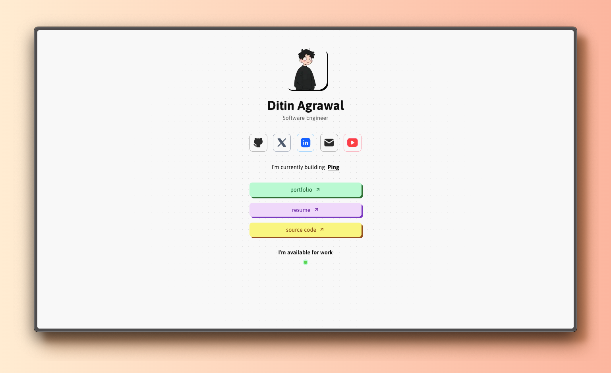

# Linkz - Personal Link Tree

A modern, minimalist personal link tree built with Next.js 15, React 19, and Tailwind CSS. This project serves as a centralized hub for showcasing professional links, social media profiles, and important resources.



## ✨ Features

- **Modern Design**: Clean, minimalist interface with subtle animations
- **Responsive Layout**: Optimized for all device sizes
- **Interactive Elements**: Hover effects and smooth transitions
- **Social Media Links**: Direct links to GitHub, LinkedIn, Twitter/X, YouTube, and email
- **Professional Links**: Portfolio, resume, and project showcases
- **Availability Status**: Visual indicator showing current work availability
- **Dot Pattern Background**: Subtle visual enhancement with CSS masking

## 🚀 Tech Stack

- **Framework**: Next.js 15 with App Router
- **Frontend**: React 19
- **Styling**: Tailwind CSS 4
- **Icons**: Tabler Icons React
- **Animation**: Motion (Framer Motion)
- **Language**: TypeScript
- **Package Manager**: Bun

## 🛠️ Getting Started

### Prerequisites

- Node.js 18+ or Bun
- Git

### Installation

1. Clone the repository:

```bash
git clone https://github.com/ditinagrawal/linkz.git
cd linkz
```

2. Install dependencies:

```bash
bun install
# or
npm install
```

3. Run the development server:

```bash
bun dev
# or
npm run dev
```

4. Open [http://localhost:3000](http://localhost:3000) in your browser.

## 📁 Project Structure

```
linkz/
├── app/                    # Next.js App Router
│   ├── globals.css        # Global styles
│   ├── layout.tsx         # Root layout
│   └── page.tsx          # Home page
├── components/            # React components
│   ├── dot-pattern.tsx   # Background pattern
│   ├── info.tsx          # Profile info section
│   ├── links.tsx         # Main action links
│   └── socials.tsx       # Social media links
├── lib/                   # Utility functions
│   └── utils.ts          # Helper utilities
├── public/               # Static assets
│   ├── avatar.jpg        # Profile picture
│   ├── og.webp          # Open Graph image
│   └── preview.png      # Project preview
└── package.json         # Dependencies and scripts
```

## 🎨 Customization

### Personal Information

Update the following files to customize for your own use:

- `components/info.tsx` - Change name, title, and avatar
- `components/socials.tsx` - Update social media links
- `components/links.tsx` - Modify main action buttons
- `app/page.tsx` - Update the "currently building" section

### Styling

The project uses Tailwind CSS for styling. Key customization points:

- Color scheme: Modify color classes in components
- Layout: Adjust spacing and sizing in component files
- Animations: Update transition classes for different effects

### Images

Replace the following images in the `public/` folder:

- `avatar.jpg` - Your profile picture (120x120px recommended)
- `preview.png` - Screenshot for README
- `og.webp` - Open Graph image for social sharing

## 🚀 Deployment

### Vercel (Recommended)

1. Push your code to GitHub
2. Connect your repository to [Vercel](https://vercel.com)
3. Deploy with zero configuration

### Other Platforms

The project can be deployed to any platform that supports Next.js:

- Netlify
- Railway
- Render
- AWS Amplify

## 👨‍💻 Author

**Ditin Agrawal**

- Portfolio: [portfolio.ditin.in](https://portfolio.ditin.in)
- GitHub: [@ditinagrawal](https://github.com/ditinagrawal)
- LinkedIn: [ditinagrawal](https://linkedin.com/in/ditinagrawal)
- Twitter: [@ditinagrawal](https://x.com/ditinagrawal)

Give a ⭐️ if this project helped you!
